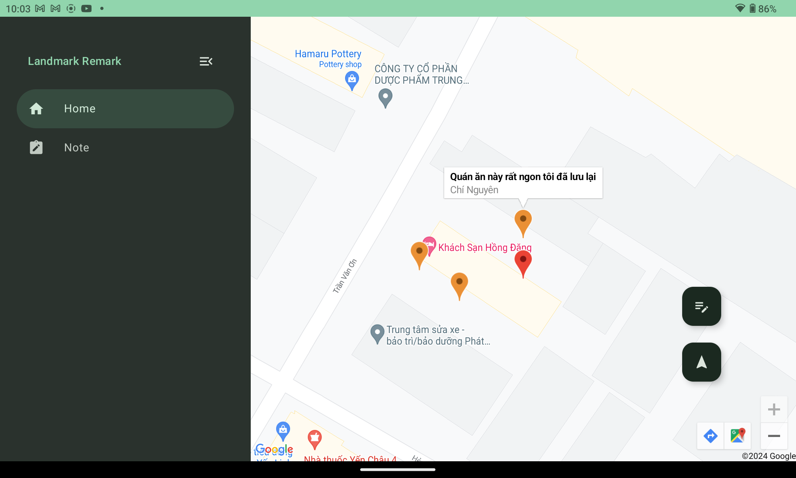

# Landmark Remark for tcnguyen

Landmark Remark  is a sample app built with [Jetpack Compose][compose] that allows users to save location based notes on a map. These notes can be 
displayed on the map where they were saved and viewed by the user that 
created the note as well as other users of the application .

To try out this sample app, use the latest stable version
of [Android Studio](https://developer.android.com/studio).
You can clone this repository or import the
project from Android Studio following the steps
[here](https://developer.android.com/jetpack/compose/setup#sample).


This sample showcases:
* Build adaptive layouts
* UI state management with StateFlow and SharedFlow
* Integration with Architecture Components: ViewModel
* Text Input and response results for searching
* Google map API and Maps Compose Library 
* Use Cloud Firestore to save data 
* Dark mode and light mode
* Material Design 3 theming and Material You dynamic color

## Branches
[development](https://github.com/nguyentran1112/Landmark-Remark/tree/development)
- Landmark Remark app development


## Code style
Using [ktlint](https://github.com/pinterest/ktlint) in [development](https://github.com/nguyentran1112/Landmark-Remark/tree/development) branch for the code style checking

### Commands
Checking command
`./gradlew ktlintCheck  `

Fixing command
`./gradlew ktlintFormat`

### Google Map API key

Google Map API key will save on file [local.properties](), and it was ignored. 

## Screenshots
### Home screen (Light mode)


### Bottom sheet to add note (Light mode)


### Note screen (Light mode)


### Note screen (Dark mode)


### Note screen for Tab (Dark mode)


### Home screen for Tab (Dark mode)


### Status: ✅ Done

Landmark Remark is still in under development, and some features are not yet implemented. But it was done based on the backlog of the product owner.

    1. As a user (of the application) I can see my current location on a map 
    2. As a user I can save a short note at my current location  
    3. As a user I can see notes that I have saved at the location they were saved 
    on the map  
    4. As a user I can see the location, text, and user-name of notes other users 
    have saved  
    5. As a user I have the ability to search for a note based on contained text or 
    user-name

## Features

### Build adaptive layouts
The UI for Landmark Remark should be responsive to account for different screen sizes, orientations and form factors. An adaptive layout changes based on the screen space available to it. 


### UI State management
The [LandmarkRemarkApp](/app/src/main/java/tcnguyen/app/landmarkremark/LandmarkRemarkApp.kt") composable is the entry point to this screen and takes a [landmarkRemarkHomeUIState](/app/src/main/java/tcnguyen/app/landmarkremark/LandmarkRemarkApp.kt) that defines the data to be displayed. This doesn't mean all the state is served from a single point: composables can have their own state too. For an example, see `tabState` in [LandmarkRemarkApp](app/src/main/java/com/example/compose/jetchat/conversation/Conversation.kt)


### Architecture Components
Share data between compose and observe state from a [ViewModel](https://developer.android.com/topic/libraries/architecture/viewmodel), served via [StateFlow and SharedFlow](https://developer.android.com/topic/libraries/architecture/livedata).


### Text Input and response results for searching
When the user searches by username or note content, use debounce and catch events of StateFlow - WhileSubscribed. To combine text queries to return a response result.


### Google map API and Maps Compose Library 
Landmark Remark use Google map API and Maps Compose Library to display map screen.

You can see your current location on a map (red marker)

You can save a short note at your current location

You can see notes that You have saved at the location they were saved on the map

You can see multiple marker of others users. When the system have notes were created by users. (orange marker)


### Cloud Firestore to save data
All the data about a note will be saved to the cloud Firestore.


### Dark mode and light mode
Landmark Remark will switch the UI to Dark mode or Light mode based on the settings of the Android system.


### Material Design 3 theming and Material You dynamic color
Landmark Remark follows the [Material Design 3](https://m3.material.io) principles and uses the `MaterialTheme` composable and M3 components. On Android 12+ Landmark Remark supports Material You dynamic color, which extracts a custom color scheme from the device wallpaper. Landmark Remark uses a custom, branded color scheme as a fallback. It also implements custom typography using the Karla and Montserrat font families.

## Known issues
1. If the emoji selector is shown, clicking on the TextField can sometimes show both input methods.
Tracked in https://issuetracker.google.com/164859446

2. There are only two profiles, clicking on anybody except "me" will show the same data.

## License
```
Copyright 2020 The Android Open Source Project

Licensed under the Apache License, Version 2.0 (the "License");
you may not use this file except in compliance with the License.
You may obtain a copy of the License at

    https://www.apache.org/licenses/LICENSE-2.0

Unless required by applicable law or agreed to in writing, software
distributed under the License is distributed on an "AS IS" BASIS,
WITHOUT WARRANTIES OR CONDITIONS OF ANY KIND, either express or implied.
See the License for the specific language governing permissions and
limitations under the License.
```

[compose]: https://developer.android.com/jetpack/compose
[coil-accompanist]: https://google.github.io/accompanist/coil/